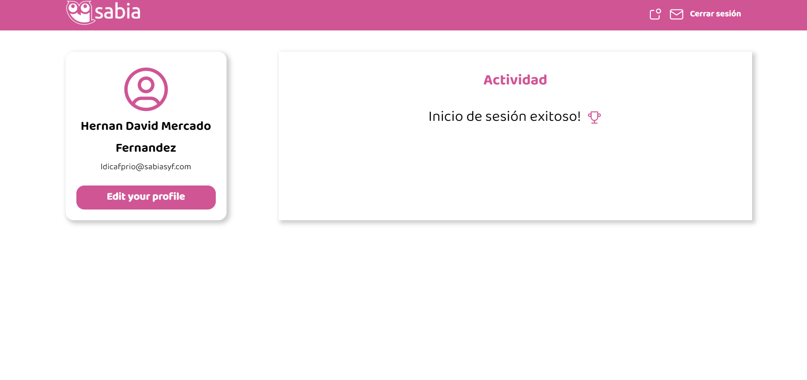
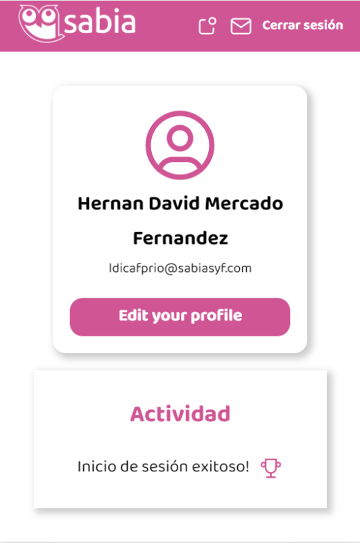

    

<h1 id="web">Sabia Login App</h1>

Technical Test to prove my Frontend skills and REST handling

You can see the live preview → [Sabia Login App](link-here).

## Index

- [Demo project](#web)
- [Getting started](#scripts)
- [Preview](#preview)
  - [Desktop](#desktop)
  - [Mobile](#mobile)
- [Technologies](#technologies)

<h2 id="scripts">🔥 Getting started</h2>
Once you have downloaded the project in your local enviroment you need to execute 'npm install' and then 'npm run dev' to see the project in development 
 
 

<h2 id="preview">🔍 Preview</h2>

  
💻 Desktop version
    
  
  
  
  

  
📱 Mobile version
  
  
  
  
  

 
 
<h2 id="technologies">📲 Technologies</h2>

1. React
2. Vainilla CSS
3. Vite.js
4. Axios
5. React-router-dom
